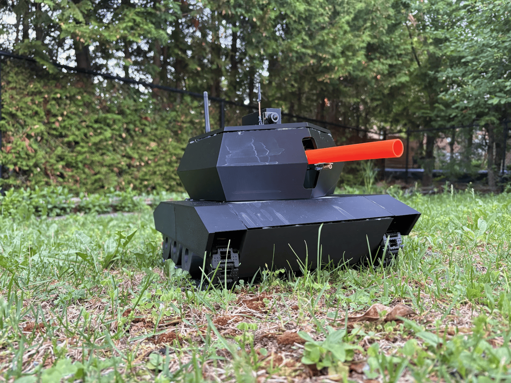

# Sentinel - Remote-Controlled FPV Tank

Sentinel is a custom-built tracked remote-controlled vehicle designed and engineered from the ground up. The project combines mechanical design, embedded systems, wireless communication, and robotics into a single platform.

Built as a personal engineering challenge, Sentinel features a 3D-printed chassis, tracked drivetrain, 2.4 GHz wireless control system, 5.8 GHz FPV camera system, and a rotating Nerf turret. The tank is controlled by an Arduino-based embedded system, with future plans for onboard computer vision and autonomous capabilities using a Raspberry Pi.

The project involved designing the mechanical structure in CAD, fabricating custom parts, integrating electronics, developing the control software, and debugging a complex system of motors, sensors, and communication protocols.

## Motivation

Sentinel began as a challenge taken by two friends to build something beyond a typical classroom robot. Rather than creating a simple automated device, we wanted to explore how mechanical design, electronics, and software could come together in a complete robotics system.

## Features
- Custom 3D-printed tracked chassis
- Wireless remote control using 2.4 GHz communication
- Live 5.8 GHz analog FPV video transmission
- 360° rotating turret mechanism
- Arduino-based motor and actuator control
- Modular electronics and power distribution system
- Designed for future computer vision integration

## Technologies Used

### Hardware
- Arduino UNO R4 WiFi
- nRF24L01 wireless modules
- FPV camera, FPV monitor, and 5.8 GHz video transmitter
- Xbox controller
- DC gear motors and drivers
- Servo motors
- Stepper motor and driver
- 7.4 V 2S Li-ion battery supply
- Custom 3D-printed components

### Software
- Arduino C/C++
- Libraries including RF24, Servo, SPI, AccelStepper, XBOXONE from USB Host Shield 2.0

## Additional Resources

### CAD: 
[Onshape Project](https://cad.onshape.com/documents/b79e3abf584a43eee74fb859/w/d53a2419a0c5a431a686b558/e/01db5a0ad86b4068f335d182)  

### Weekly Journals:
[Week 1](https://docs.google.com/document/d/17Ajz8vXUG7C8QsSIpln7xRcLZVNVRcxvSVOUbZ24IYE/edit?usp=drive_link)  
[Week 2](https://docs.google.com/document/d/1W2MT0a_K2rhyGGTUNjvPy9FhipLKN2GWRZDyP753SX8/edit?usp=drive_link)  
[Week 3](https://docs.google.com/document/d/1quGVF-udUrTEX0IsD0kGBSyIRfxL883lqCnuZsB9mRc/edit?usp=drive_link)  
[Week 4](https://docs.google.com/document/d/1nc7bcCtwF5eugCoS6nO4E-aOTwUAF1d3NM4IUmDgt2E/edit?usp=drive_link)  
[Week 5](https://docs.google.com/document/d/1DuefWYwJcpw5OrmmurFnuGTMt__FWnk-4Q0KD2fvWug/edit?usp=drive_link)  
[Week 6](https://docs.google.com/document/d/11cAzaXNtNuGknSWchcGKMZekuylMzRt6ZZdopK9-in4/edit?usp=drive_link)  
[Week 7](https://docs.google.com/document/d/1Xcf18F4qVJCFmCrfTtPlUHFmC-JLRS2L01wTzXku7aY/edit?usp=drive_link)  
[Week 8](https://docs.google.com/document/d/1gu44P50zj96eCYETs0mco7hnURLjBjI5FsbhsaJNU7Q/edit?usp=drive_link)  
[Week 9](https://docs.google.com/document/d/1yQiESRAvD3YaRqxrGDqdF1br9n9rZQMoo9KKtbfv1E4/edit?usp=drive_link)  
[Week 10](https://docs.google.com/document/d/1YnJN5dJ7Cn3t6fgoHze17Jr2m_I_HSLMdpS_-rjgBwo/edit?usp=drive_link)  
  
### Course Reflection:
[Reflection](https://docs.google.com/document/d/1j7IExLx8Kn-AHnMsANZGUDmCsnGpeQEc7mS2ZHUMuxA/edit?usp=sharing)

  
